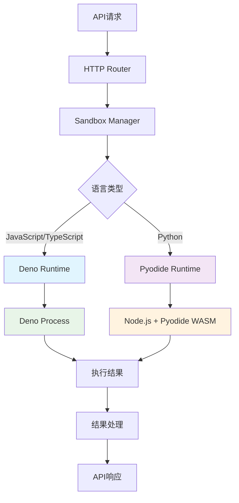

# Sandbox 架构设计文档

本文档描述了Cozeloop Sandbox代码执行环境的系统架构、技术选型和关键设计决策。

## 1. 总体架构

### 1.1 架构图



### 1.2 分层架构

```
┌─────────────────────────────────────────┐
│              API Layer                  │  HTTP接口层
├─────────────────────────────────────────┤
│           Application Layer             │  应用服务层
├─────────────────────────────────────────┤
│             Domain Layer                │  领域业务层
├─────────────────────────────────────────┤
│          Infrastructure Layer           │  基础设施层
│  ┌─────────────┐    ┌─────────────────┐ │
│  │ Deno Runtime│    │ Pyodide Runtime │ │
│  └─────────────┘    └─────────────────┘ │
└─────────────────────────────────────────┘
```

## 2. 核心组件

### 2.1 API Layer (接口层)
- **HTTP Router**: 路由管理和请求分发
- **Request Handler**: 请求处理和参数验证
- **Response Formatter**: 响应格式化和错误处理

### 2.2 Application Layer (应用层)
- **Sandbox App**: 主应用服务，协调各组件
- **Request Validator**: 请求参数验证
- **Result Processor**: 结果处理和格式转换

### 2.3 Domain Layer (领域层)
- **Sandbox Manager**: 沙箱管理器，核心业务逻辑
- **Runtime Interface**: 运行时抽象接口
- **Execution Context**: 执行上下文管理

### 2.4 Infrastructure Layer (基础设施层)

#### Deno Runtime
- **Deno Client**: Deno进程管理和通信
- **Code Validator**: JavaScript/TypeScript代码验证
- **Security Policy**: 安全策略配置

#### Pyodide Runtime  
- **Pyodide Client**: Pyodide环境管理
- **WASM Loader**: WebAssembly模块加载
- **Python Executor**: Python代码执行器

## 3. 技术选型

### 3.1 核心技术栈

| 组件 | 技术选型 | 版本 | 选择理由 |
|------|----------|------|----------|
| 后端框架 | Go | 1.21+ | 高性能、并发支持、类型安全 |
| JavaScript运行时 | Deno | 1.40+ | 安全沙箱、TypeScript原生支持 |
| Python运行时 | Pyodide | 0.26+ | WebAssembly隔离、科学计算支持 |
| HTTP框架 | Gin | 1.9+ | 轻量级、高性能 |
| 容器化 | Docker | 20.10+ | 环境一致性、部署便利 |

### 3.2 技术选型对比

#### JavaScript/TypeScript执行方案
| 方案 | 优点 | 缺点 | 选择 |
|------|------|------|------|
| **Deno** | 安全沙箱、TypeScript原生支持、现代API | 生态相对较小 | ✅ 采用 |
| Node.js | 生态丰富、性能优秀 | 安全性需额外配置 | ❌ 不采用 |
| V8 Isolate | 性能最佳、隔离性强 | 实现复杂、维护成本高 | ❌ 不采用 |

#### Python执行方案
| 方案 | 优点 | 缺点 | 选择 |
|------|------|------|------|
| **Pyodide** | WASM隔离、科学计算支持 | 启动较慢、包支持有限 | ✅ 采用 |
| Docker Python | 完整Python环境 | 启动慢、资源占用高 | ❌ 不采用 |
| RestrictedPython | 轻量级 | 安全性不足 | ❌ 不采用 |

## 4. 关键设计决策

### 4.1 安全设计

#### 多层安全防护
1. **进程隔离**: 每个代码执行在独立进程中
2. **沙箱隔离**: Deno和Pyodide提供的沙箱环境
3. **资源限制**: 内存、时间、输出大小限制
4. **代码验证**: 静态代码分析，检测危险操作

#### 安全策略配置
```go
type SecurityConfig struct {
    MemoryLimit    int64         // 内存限制 (128MB)
    TimeoutLimit   time.Duration // 执行超时 (30s)
    MaxOutputSize  int64         // 输出大小限制 (1MB)
    NetworkAccess  bool          // 网络访问 (false)
    FileSystemAccess bool        // 文件系统访问 (false)
}
```

### 4.2 性能优化

#### 进程池化
- **Deno进程池**: 预启动Deno进程，减少启动开销
- **Pyodide实例复用**: 复用已初始化的Pyodide环境

#### 缓存策略
- **代码编译缓存**: TypeScript编译结果缓存
- **模块加载缓存**: 常用模块预加载

#### 资源管理
- **进程池**: 预启动进程，减少启动开销
- **内存监控**: 实时监控内存使用情况  
- **并发控制**: 限制最大并发执行数

### 4.3 错误处理

#### 错误分类
- **ValidationError**: 参数验证错误
- **RuntimeError**: 运行时错误
- **TimeoutError**: 超时错误
- **MemoryError**: 内存错误
- **SecurityError**: 安全错误

#### 错误恢复机制
- **进程崩溃恢复**: 自动重启崩溃的运行时进程
- **资源泄漏检测**: 定期检测和清理资源泄漏
- **降级策略**: 在高负载时的服务降级

## 5. 数据流设计

### 5.1 执行流程

```
用户请求 → 参数验证 → 语言识别 → 运行时选择 → 代码执行 → 结果处理 → 响应返回
    ↓         ↓         ↓         ↓         ↓         ↓         ↓
  HTTP     JSON      Language   Runtime   Sandbox   Format   JSON
 Request   Parse     Detection  Selection Execution  Result  Response
```

### 5.2 数据转换

#### 数据标准化
- **输入**: 统一的请求格式，包含代码、语言、输入数据
- **输出**: 标准化的结果格式，包含执行结果、状态、耗时

## 6. 部署架构

### 6.1 容器化部署

```dockerfile
# 多阶段构建
FROM golang:1.21-alpine AS builder
# 构建Go应用

FROM denoland/deno:alpine AS runtime
# 安装运行时依赖
# 复制构建产物
```

### 6.2 服务配置

```yaml
# docker-compose.yml
version: '3.8'
services:
  sandbox:
    build: .
    ports:
      - "8080:8080"
    environment:
      - MEMORY_LIMIT=128MB
      - TIMEOUT_LIMIT=30s
    volumes:
      - ./logs:/app/logs
    restart: unless-stopped
```

## 7. 监控和运维

### 7.1 性能指标

| 指标 | 目标值 | 监控方式 |
|------|--------|----------|
| 响应时间 | P95 < 500ms | HTTP监控 |
| 错误率 | < 1% | 错误日志统计 |
| 内存使用 | < 512MB | 系统监控 |
| CPU使用 | < 80% | 系统监控 |

### 7.2 日志记录

记录关键执行信息：请求ID、语言类型、执行时间、成功状态、错误信息、时间戳。

### 7.3 健康检查

- **服务健康**: HTTP健康检查端点
- **运行时健康**: Deno和Pyodide环境状态检查
- **资源健康**: 内存、CPU使用率检查

## 8. 扩展性设计

### 8.1 新语言支持

通过实现标准Runtime接口添加新语言支持，包含Execute、Validate、GetLanguage等方法。

### 8.2 插件机制

- **代码验证插件**: 自定义代码安全检查
- **结果处理插件**: 自定义结果格式化  
- **监控插件**: 自定义监控指标收集

### 8.3 配置管理

支持分层配置：服务器配置、安全配置、运行时配置、日志配置。

## 9. 未来规划

### 9.1 短期目标 (1-3个月)
- 性能优化：进程池化、缓存机制
- 监控完善：详细指标、告警机制
- 文档完善：API文档、运维手册

### 9.2 中期目标 (3-6个月)
- 语言扩展：支持更多编程语言
- 集群部署：多实例负载均衡
- 安全增强：更严格的安全策略

### 9.3 长期目标 (6-12个月)
- 云原生：Kubernetes部署
- 微服务：服务拆分和治理
- AI集成：智能代码分析和优化